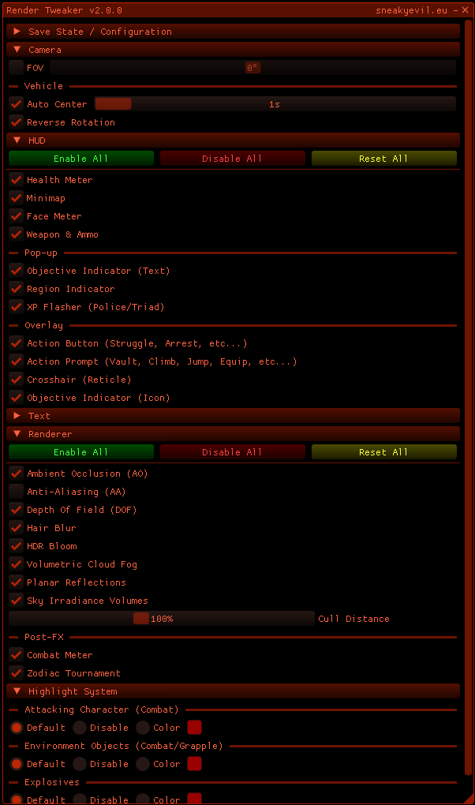

---

## Installation
1. You will need a compatible [Steam Executable v1.0](https://mega.nz/file/fK5SWARD#1fAWkxAHaKCIMDaJ5XAQKvjs6gK4RCQo5ZlvvtHWtVw). 
2. Download the latest `Release.zip` file from Releases or by [clicking here](https://github.com/sneakyevil/SD-RenderTweaker/releases/latest/download/Release.zip).
3. Extract all files into the game folder.
- Linux Users, add the following to the game's launch options: `WINEDLLOVERRIDES="dinput8=n,b" %command%`.

## Preview

## Bug Reports/Requests
If you encounter a bug or have a request, open an issue and provide a clear description.

## List of features
- Camera:
  - FOV
  - Vehicle:
    - Auto Center
    - Reverse Rotation
- HUD:
  - Health Meter
  - Minimap
  - Face Meter
  - Weapon & Ammo
  - Pop-up:
    - Objective Indicator (Text)
    - Region Indicator
    - XP Flasher (Police/Triad)
  - Overlay:
    - Action Button
    - Action Prompt
    - Crosshair (Reticle)
    - Objective Indicator (Icon)
- Renderer:
  - Ambient Occlusion (AO)
  - Anti-Aliasing (AA)
  - Depth Of Field (DOF)
  - Hair Blur
  - HDR Bloom
  - Volumetric Cloud Fog
  - Planar Reflections
  - Sky Irradiance Volumes
  - Cull Distance
  - Post-FX:
    - Combat Meter
    - Zodiac Tournament
  - World-FX:
    - Health UI
- Highlight System:
  - Attacking Character (Combat)
  - Environment Objects (Combat/Grapple)
  - Explosives